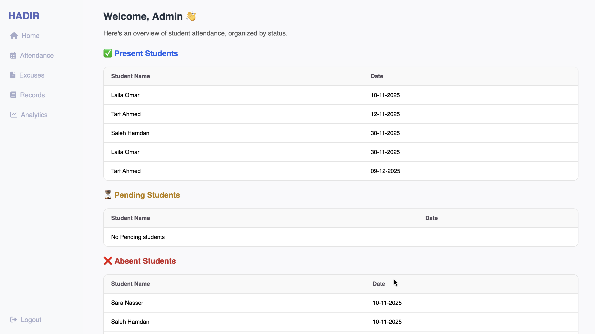

# Hadir Attendance Management System

Graduation project — backend developed using Laravel framework.

## Overview

Hadir is a web-based attendance management system developed as a Graduation Project. The system aims to automate and improve attendance tracking in educational institutions, replacing manual processes with a structured and efficient digital solution.

## My Role (Backend Developer)
- Designed database structure (MySQL)
- Developed Controllers using Laravel MVC architecture
- Implemented RESTful routes for attendance operations
- Created APIs for managing employees, attendance, and reports
- Connected backend with frontend interface

## Technologies Used
- PHP (Laravel)
- MySQL
- RESTful API
- MVC Architecture

## Screenshots

